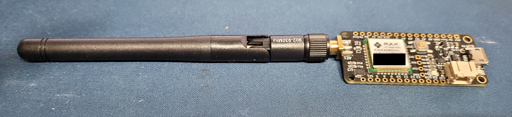
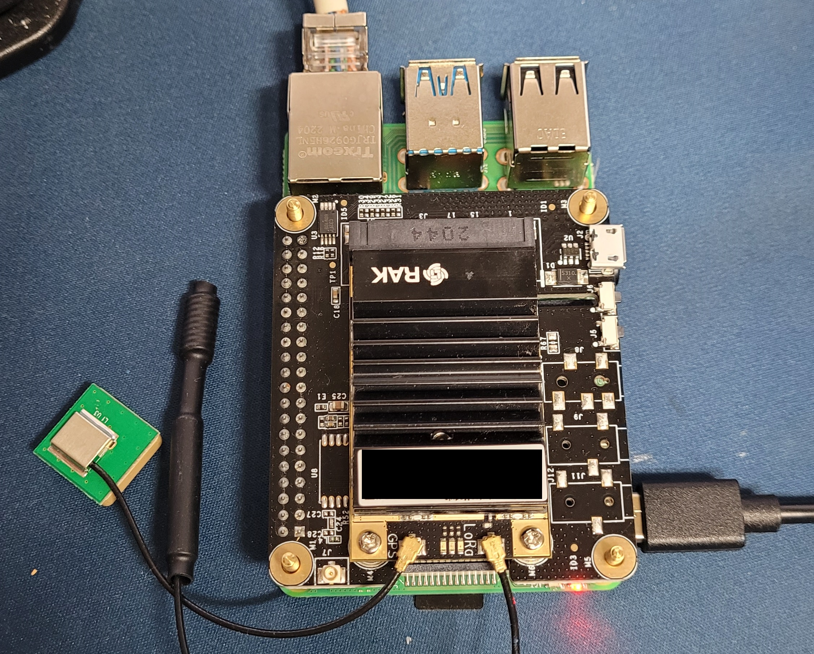
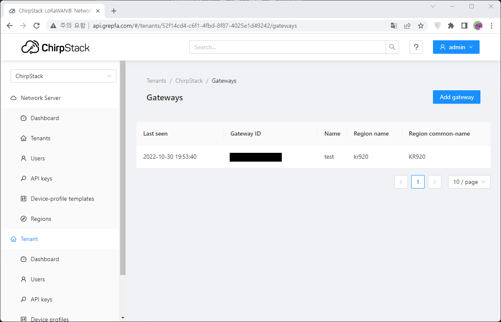

# LoRaWAN 기반 스마트팜 프로젝트 (Grepfa)
창업동아리 팀 `Grepfa`에서 진행중인 IoT 프로젝트 입니다.
>개인 블로그  
https://www.vopressor.com/tag/smartfarm/

## LoRaWAN 기반 스마트팜 단말 기기 연구
  

>https://github.com/vl0011/grepfa_lora_node

센서값 전달, 엑츄에이터 신호수신/제어 역할을하는 `LoRa`단말 기기 입니다.  
`Microchip`기반 MCU를 사용하며, `Arduino` 부트로더를 올려 사용이 가능합니다.

## LoRaWAN Gateway
  

>https://github.com/vl0011/grepfa_lora_gateway_startup

`LoRa` 단말노드의 통신을 중계하고 `MQTT` 프로토콜로 변환하여 `LoRa network server` 와 통신하는 기기 입니다.  
- 라즈베리파이 4 기반
- Embadded Linux
- [RAK 2287](https://docs.rakwireless.com/Product-Categories/WisLink/RAK2287/Overview/) 사용

## LoRaWAN Netwrok Server Project
  

>https://github.com/vl0011/grepfa_lora_network_server

[Chirpstack network server](https://www.chirpstack.io/) 서버를 보조하며 기기들을 관리하는 API 클라이언트, 서버 입니다.  
단말기기 추가/제거, 기기 사용자 관리, 상태 모니터링등을 위한 API를 제공합니다.